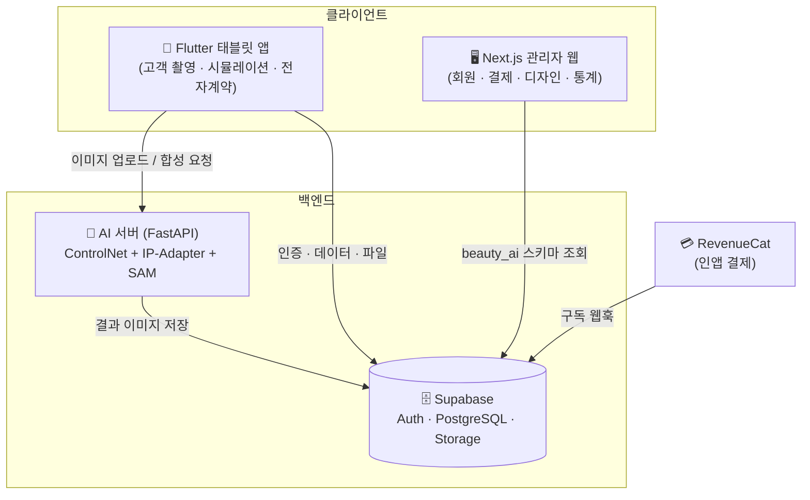

# Beauty AI SaaS — 뷰티샵 Gen-AI 시뮬레이션 플랫폼

AI 기반 눈썹 시뮬레이션 + 전자계약을 통합한 반영구 화장 전문샵용 SaaS 솔루션입니다.
Flutter 태블릿 앱 · Next.js 관리자 웹 · Python AI 서버 · Supabase 백엔드로 구성된 풀스택 모노레포입니다.

> **🔗 라이브 데모 (관리자 웹):** https://adminweb-one-psi.vercel.app

---

## 📌 프로젝트 성숙도 (정직한 현황)

이 저장소는 **완성된 상용 서비스가 아니라 MVP / 프로토타입**입니다. 컴포넌트별 실제 검증 수준은 다음과 같습니다.

| 컴포넌트 | 상태 | 비고 |
|----------|------|------|
| **관리자 웹 (Next.js)** | ✅ **동작 + 배포됨** | Vercel 라이브. Supabase `beauty_ai` 전용 스키마 연동(키 설정 시) / 미설정 시 목업 폴백 |
| Supabase 스키마 | ✅ 작성 완료 | 전체 제품용(`001`) + 관리자 데모용(`003`) 마이그레이션 제공 |
| AI 서버 (FastAPI) | ⚠️ **코드 완성 · 미검증** | 실제 모델 로딩/추론은 GPU + 모델 약 7GB 필요, 아직 미실행 |
| Flutter 앱 | ⚠️ 코드 완성 · 부분 검증 | macOS 디버그 빌드만 확인. iOS/Android·결제(RevenueCat) 미검증 |

즉 **end-to-end 실서비스 플로우는 미완성**이며, 현재 데모 가능한 핵심 산출물은 **실DB 연동형 관리자 대시보드**입니다.

---

## 🏗️ 아키텍처



---

## 🧱 기술 스택

| 구성요소 | 기술 |
|---------|------|
| 태블릿 앱 | Flutter 3.x · Riverpod · GoRouter |
| 관리자 웹 | Next.js 14 · TypeScript · Tailwind · recharts |
| AI 서버 | Python FastAPI · PyTorch · diffusers (Stable Diffusion + ControlNet + IP-Adapter) · MediaPipe · SAM |
| 데이터베이스 | Supabase (PostgreSQL) |
| 인증 / 저장 | Supabase Auth · Storage |
| 결제 | RevenueCat (인앱결제) |

---

## 📁 모노레포 구조

```
beauty-ai-saas/
├── flutter_app/        # Flutter 태블릿 앱
├── admin_web/          # Next.js 관리자 웹  ← 라이브 데모
├── ai_server/          # Python FastAPI AI 서버
├── supabase/           # DB 마이그레이션 · Edge Functions
└── docs/               # 문서
```

---

## 🚀 빠른 시작

### 관리자 웹 (admin_web)

```bash
cd admin_web
npm install

# 환경변수 (실DB 연동 시)
cp .env.example .env.local
#   - 키를 비워두거나 placeholder 면 목업 데이터로 자동 동작합니다.
#   - 실제 연동하려면 아래 "Supabase 연동" 참고 후 키를 채우세요.

npm run dev        # http://localhost:3001
```

### Supabase 연동 (관리자 대시보드 실DB)

무료 Supabase 인스턴스를 다른 프로젝트와 공유해도 충돌하지 않도록 **전용 스키마 `beauty_ai`** 를 사용합니다.

1. [supabase.com](https://supabase.com) 프로젝트 생성
2. **SQL Editor** 에서 `supabase/migrations/003_admin_demo_schema.sql` 전체 실행 (스키마 + 테이블 + 시드)
3. **Settings → API → Exposed schemas** 에 `beauty_ai` 추가 후 저장 ← **필수**
4. **Settings → API** 에서 `Project URL`, `anon public` 키를 복사해 `admin_web/.env.local` 에 입력
5. `npm run dev` → 각 탭 우상단 배지가 **🟢 실시간 DB** 로 바뀌면 연동 성공

> 키가 없으면 배지가 **🟡 데모 데이터** 로 표시되며 목업으로 동작합니다. (배포 환경도 동일)

### AI 서버 (ai_server) — GPU 필요

```bash
cd ai_server
python -m venv venv && source venv/bin/activate   # Windows: venv\Scripts\activate
pip install -r requirements.txt
cp .env.example .env                               # DEVICE=cuda 권장
uvicorn app.main:app --host 0.0.0.0 --port 8000 --reload
# API 문서: http://localhost:8000/docs
```

### Flutter 앱 (flutter_app)

```bash
cd flutter_app
flutter pub get
flutter run --dart-define=SUPABASE_URL=... \
            --dart-define=SUPABASE_ANON_KEY=... \
            --dart-define=AI_SERVER_URL=http://localhost:8000
```

---

## ☁️ 배포 (Vercel)

관리자 웹만 Vercel 배포 대상입니다. 모노레포이므로 **Root Directory 를 `admin_web`** 으로 지정해야 합니다.
환경변수(`NEXT_PUBLIC_SUPABASE_URL`, `NEXT_PUBLIC_SUPABASE_ANON_KEY`)를 프로젝트 설정에 추가하면 실DB로 동작합니다.
(AI 서버는 GPU 장시간 추론이라 Vercel 부적합 → RunPod/Replicate 등 GPU 호스트 권장)

---

## 📄 라이선스

Proprietary — All rights reserved
